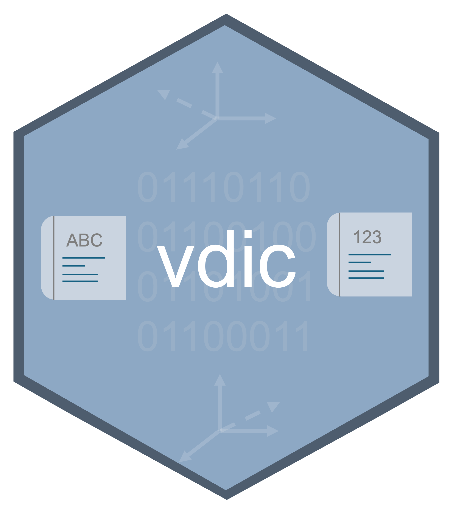

<p align="center">
  
</p>

# vdic: Build and Use Vec-tionaries for Text Analysis

A framework for building and using vector-based dictionaries (vec-tionaries) for text analysis in R. Provide seed words scored on dimensions of interest (e.g., moral foundations, sentiment, emotions), and vdic learns axes in word-embedding space that can then score *any* word---even words absent from the original dictionary.

## Design

**Users download**: Word embeddings (~1-7 GB, one-time)

**Users build**: Lightweight vec-tionaries (~3 MB) that work without embeddings

Once built, a vec-tionary is a small self-contained object. It can be saved, shared, and reused on any machine without requiring the original embedding files.

## Installation

```r
# Install from GitHub
devtools::install_github("leofdantas/vdic")
```

## Building Vec-tionaries

### 1. Download Embeddings (One-Time)

```r
library(vdic)

# Download FastText embeddings (157 languages)
download_embeddings(language = "pt", model = "fasttext")
# Saves to: vdic_data/cc.pt.300.vec (in working directory)

# English word2vec (only English)
download_embeddings(language = "en", model = "word2vec")
# Saves to: vdic_data/GoogleNews-vectors-negative300.vec

# GloVe (English)
download_embeddings(language = "en", model = "glove", dimensions = 300)
```

### 2. Create a Dictionary and Build

A dictionary can be either:
- A **data frame** with a `word` column and one or more numeric dimension columns (binary 0/1 or continuous)
- A **character vector** of seed words (creates a binary dictionary where all words score 1)

```r
# Option A: Data frame with scores
dictionary <- data.frame(
  word = c("proteger", "cuidar", "ajudar", "machucar", "prejudicar", "matar"),
  care = c(0.9, 0.8, 0.7, -0.8, -0.7, -0.9),
  fairness = c(0.1, 0.2, 0.3, 0.0, 0.1, 0.0)
)

my_vect <- vectionary_builder(
  dictionary = dictionary,
  embeddings = "vdic_data/cc.pt.300.vec",
  language = "pt"
)
# Automatically saved to: ./vectionary.rds

# Option B: Simple word list (binary dictionary)
care_words <- c("protect", "care", "help", "safe", "nurture")
care_vect <- vectionary_builder(
  dictionary = care_words,
  embeddings = "vdic_data/cc.en.300.vec",
  language = "en",
  save_path = "care_vectionary.rds"
)

# To skip auto-saving:
my_vect <- vectionary_builder(dictionary, embeddings, save_path = NULL)
```

### 3. Analyze Text

```r
# Single text (returns named list)
my_vect$mean("Devemos proteger as pessoas vulneraveis")
#> $care
#> [1] 0.0523456
#> $fairness
#> [1] 0.0234567

# All metrics at once
my_vect$metrics("We need to protect vulnerable citizens from harm")

# Batch analysis: pass a vector of texts (returns named list of vectors)
texts <- c("Protect vulnerable citizens", "Justice for all", "The sky is blue")
result <- vectionary_analyze(my_vect, texts, metric = "mean")
#> $care
#> [1] 0.0523456 0.0123456 0.0002345
#> $fairness
#> [1] 0.0234567 0.0534567 0.0003456

# Convert to data frame when needed
as.data.frame(result)
```

### 4. Topic Classification

Identify which documents exceed a statistical threshold on each dimension. When you pass `alpha` to `vectionary_analyze()`, the function computes a one-tailed t-test threshold per dimension and appends logical `_topic` columns to the result.

The threshold for each dimension is:

$$\text{threshold}_d = \bar{x}_d + t_{1-\alpha,\, n-1} \cdot s_d$$

where $\bar{x}_d$ is the corpus mean, $s_d$ is the corpus (sample) standard deviation, and $t_{1-\alpha,n-1}$ is the critical value from the t-distribution.

```r
texts <- c(
  "We must protect the vulnerable and care for the weak",
  "Justice demands equal treatment under the law",
  "The weather is nice today",
  "Loyalty to your group is a sacred duty"
)

# alpha = 0.05 → documents scoring above the 95th percentile threshold
result <- vectionary_analyze(my_vect, texts, metric = "mean", alpha = 0.05)
result$care_p          # numeric vector of scores
result$care_p_topic    # logical vector of topic flags

# Inspect the thresholds used
attr(result, "threshold")

# Convert to data frame
as.data.frame(result)
```

**Notes:**
- Requires at least 2 documents (a single text produces a warning and skips classification)
- Works with any single metric (`"mean"`, `"rms"`, `"sd"`, `"se"`, `"top_10"`, `"top_20"`)
- When `metric = "all"`, topic flags are stored in `result$topic` (a named list)
- Lower `alpha` values (e.g., 0.01) produce stricter thresholds; higher values (e.g., 0.10) are more lenient

### 5. Diagnose

Verify that your seed words rank near the top of the projections:

```r
my_vect$diagnose()
# Or: vectionary_diagnose(my_vect, n = 50, dimension = "care")
```

### 6. Save and Load

```r
# Vec-tionaries are automatically saved during build
# To load later:
my_vect <- readRDS("vectionary.rds")
```

## Metrics

Each vec-tionary object exposes the following methods via the `$` operator:

| Method | Description |
|--------|-------------|
| `$mean(text)` | Arithmetic mean of word projections |
| `$rms(text)` | Root mean square (emphasizes high-magnitude words) |
| `$sd(text)` | Standard deviation of projections |
| `$se(text)` | Standard error of the mean |
| `$top_10(text)` | Mean of 10 highest projections |
| `$top_20(text)` | Mean of 20 highest projections |
| `$metrics(text)` | All six metrics at once |
| `$diagnose(n)` | Diagnostic report (top words, seed word ranks) |

All metrics accept a single string or a character vector for batch analysis. Results are returned as named lists (one element per dimension). Use `as.data.frame()` to convert.

## Builder Options

### Regularization Methods

```r
# Ridge regression (default) -- smooth, dense axes
vectionary_builder(dictionary, embeddings, method = "ridge")

# Elastic net -- balanced sparsity
vectionary_builder(dictionary, embeddings, method = "elastic_net", l1_ratio = 0.5)

# LASSO -- maximum sparsity
vectionary_builder(dictionary, embeddings, method = "lasso")

# Duan et al. (2025) method -- unit norm constraint, no regularization
vectionary_builder(dictionary, embeddings, method = "duan")
```

### Lambda Selection (Regularization Strength)

Lambda controls regularization strength. The default is GCV (Generalized Cross-Validation), which automatically selects the optimal value.

```r
# GCV (default) -- closed-form optimal lambda for ridge regression
# For lasso/elastic_net, uses glmnet::cv.glmnet internally
vectionary_builder(dictionary, embeddings, lambda = "gcv")

# Fixed lambda
vectionary_builder(dictionary, embeddings, lambda = 0.1)

# Custom range: test these values, select best based on validity + differentiation
vectionary_builder(dictionary, embeddings, lambda = c(0.01, 0.1, 0.5, 1))
```

When a numeric vector of lambdas is provided, the builder tests each value and selects the one that:
1. Meets the minimum validity threshold (`min_validity`, default 0.75)
2. Has the lowest axis correlation (best differentiation between dimensions)

Validity is measured as AUC (binary dictionaries) or R-squared (continuous dictionaries).

### Reproducibility (Seed)

All random operations (Duan method initialization, AUC validation sampling) are controlled by a single seed. If not provided, a random seed is generated and stored in the vec-tionary metadata.

```r
# Set seed for reproducible builds
my_vect <- vectionary_builder(dictionary, embeddings, seed = 42)

# Check which seed was used (including auto-generated ones)
my_vect$metadata$seed
```

### Language and Spell Checking

Any language from [wooorm/dictionaries](https://github.com/wooorm/dictionaries) is supported (auto-downloaded)

```r
# Language controls stopwords and spell checking
vectionary_builder(dictionary, embeddings, language = "pt")
vectionary_builder(dictionary, embeddings, language = "en")
vectionary_builder(dictionary, embeddings, language = "fr")

# Disable spell checking (on by default)
vectionary_builder(dictionary, embeddings, spellcheck = FALSE)

# Disable stopword removal
vectionary_builder(dictionary, embeddings, remove_stopwords = FALSE)

# Custom stopwords
vectionary_builder(dictionary, embeddings, remove_stopwords = c("the", "a", "an"))
```

### Vocabulary Expansion

Expand the training dictionary by finding semantically related words in the embeddings:

```r
vectionary_builder(
  dictionary, embeddings,
  expand_vocab = 5000,       # add top-5000 related words
  expand_positive = TRUE     # keep only positively-projected words (default)
)
```

This first learns preliminary axes from the seed words, finds the top-N words with highest projections, adds them to the dictionary, and rebuilds the axes with the expanded dictionary.

### Stem Expansion

Expand dictionary patterns like `abandon*` to all matching words in the embeddings:

```r
dict <- c("abandon*", "care*", "protect*")
vectionary_builder(dict, embeddings, expand_stem = TRUE)
# Expands to: abandon, abandoned, abandoning, abandonment, care, caring, ...
```

### Binary vs. Continuous Dictionaries

```r
# Binary (default): non-zero values become 1, NA/blank become 0
vectionary_builder(dictionary, embeddings, binary_word = TRUE)

# Continuous: use graded scores as provided
vectionary_builder(dictionary, embeddings, binary_word = FALSE)
```

## Build Pipeline

The `vectionary_builder()` function runs a 7-step pipeline:

1. **Filter embedding vocabulary** -- Remove non-alphabetic tokens, stopwords, and misspelled words (hunspell). Writes a cleaned temp copy of the embeddings.
2. **Expand stem patterns** -- If `expand_stem = TRUE`, match patterns like `abandon*` to all inflected forms in the filtered embeddings.
3. **Select lambda** -- Automatically choose the regularization parameter via GCV (ridge), cross-validation (elastic net/lasso), or grid search.
4. **Learn axes** -- For each dimension, solve a regression problem mapping seed-word embeddings to dictionary scores. The learned axis is a vector in embedding space.
5. **Expand vocabulary** (optional) -- Find the top-N words with highest projections onto the preliminary axes and add them to the dictionary.
6. **Rebuild** (if expanded) -- Re-learn axes using the enlarged dictionary for improved signal.
7. **Project full vocabulary** -- Compute dot products between every word in the filtered embeddings and the learned axes. Package into a `Vec-tionary` S3 object and save.

## Embedding Sources

| Model | Languages | Download |
|-------|-----------|----------|
| FastText | 157 languages | `download_embeddings("pt", "fasttext")` |
| word2vec | English | `download_embeddings("en", "word2vec")` |
| GloVe | English | `download_embeddings("en", "glove")` |

Custom embeddings in `.vec` or `.txt` format (word followed by space-separated vector components, one word per line) can be passed directly to `vectionary_builder()`. Both FastText (with header line) and GloVe (without header) formats are auto-detected.

## Technical Details

- All word embeddings are **normalized to unit Euclidean norm** before axis learning and projection. This removes magnitude bias from FastText/word2vec (frequent words have inflated norms) and makes projections cosine-similarity-based.
- Ridge/elastic net/lasso axes are **not** unit-normalized -- their raw regression scale encodes the mapping from cosine similarity to dictionary scores.
- The Duan et al. (2025) method uses constrained optimization (`alabama::auglag`) with a unit-norm axis constraint and no regularization.
- Non-alphabetic tokens (numbers, codes, symbols) are **always** filtered from the embedding vocabulary using Unicode-aware regex (`\p{L}`), supporting accented characters and non-Latin scripts.
- Case-variant duplicates (e.g., "Gás" and "gás") are deduplicated during filtering, keeping the first occurrence (highest-frequency vector in FastText).
- GCV (Golub et al., 1979) selects lambda by minimizing $GCV(\lambda) = \frac{n^{-1} \|y - S_\lambda y\|^2}{(1 - \text{tr}(S_\lambda)/n)^2}$ via SVD of the embedding matrix.
- Topic classification uses a one-tailed t-test: threshold = $\bar{x} + t_{1-\alpha,\, n-1} \cdot s$ per dimension, where $\bar{x}$ and $s$ are the corpus (sample) mean and standard deviation.
- All standard deviations and standard errors use **sample** (Bessel-corrected, $n-1$ denominator) statistics, not population.
- RNG state is preserved and restored in functions that call `set.seed()`, so building a vec-tionary does not alter the user's random number stream.

## Requirements

- R >= 3.5.0
- R.utils, cli, MASS, glmnet, data.table (installed automatically)
- Optional: hunspell (spell checking), alabama (Duan method)

## Citation

```bibtex
@software{vdic,
  title = {vdic: Build and Use Vec-tionaries for Text Analysis},
  author = {Leonardo Dantas},
  year = {2026},
  url = {https://github.com/leofdantas/vdicverse}
}
```

## Related Work

This package generalizes the vec-tionary approach introduced in:

- Duan, Z., Shao, A., Hu, Y., Lee, H., Liao, X., Suh, Y. J., Kim, J., et al. (2025). "Constructing Vec-Tionaries to Extract Message Features from Texts: A Case Study of Moral Content." *Political Analysis*, 1--21. doi:10.1017/pan.2025.6.
- https://github.com/ZeningDuan/vMFD

## License

MIT
